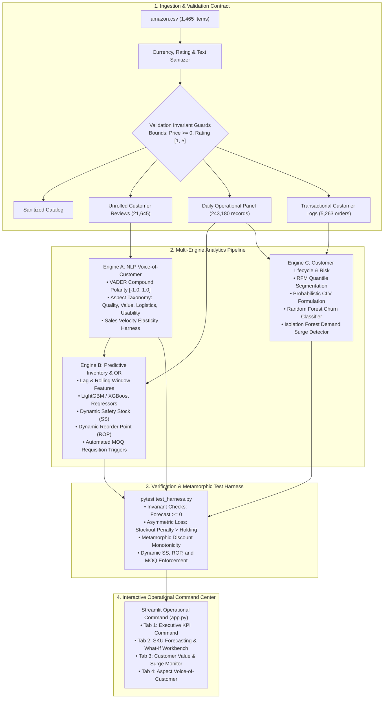

# 📦 Amazon Supply Chain & AI Intelligence Hub

[](https://www.python.org/downloads/)
[](https://opensource.org/licenses/MIT)
[](https://streamlit.io)
[]()
[](https://github.com/psf/black)

An end-to-end Machine Learning, Aspect-Based Natural Language Processing (NLP), Operations Research (OR), and Predictive Analytics platform engineered on an e-commerce catalog dataset (`amazon.csv`), complete with an interactive operational command dashboard.

---

## 🏗️ System Architecture



---

## 📐 Mathematical Formulations & Operations Research

### 1. Dynamic Safety Stock ($SS$)
Buffers against both demand volatility ($\sigma_d$) and vendor replenishment lead-time variability ($\sigma_L$):
$$SS = Z \times \sqrt{L \cdot \sigma_d^2 + d^2 \cdot \sigma_L^2}$$
* $Z$: Standard normal critical value for cycle service level (e.g., $95\% \rightarrow 1.645$, $99\% \rightarrow 2.326$).
* $L, \sigma_L$: Supplier replenishment lead time mean and standard deviation.
* $d, \sigma_d$: Daily SKU demand mean and standard deviation.

### 2. Dynamic Reorder Point ($ROP$)
$$ROP = (d \times L) + SS$$

### 3. Stockout Risk Probability
$$P(\text{Stockout}) = 1 - \Phi\left(\frac{\text{Current Inventory} - d \cdot L}{\sqrt{L \cdot \sigma_d^2 + d^2 \cdot \sigma_L^2}}\right)$$

### 4. Asymmetric Business Loss Function
Stockouts directly forfeit sales and degrade customer retention; hence, under-forecasting is penalized at $C_{stockout} = 5.0$ vs. excess holding $C_{holding} = 1.0$:
$$\mathcal{L}(y, \hat{y}) = \sum_{t} \left[ C_{stockout} \times \max(y_t - \hat{y}_t, 0) + C_{holding} \times \max(\hat{y}_t - y_t, 0) \right]$$

### 5. Probabilistic Customer Lifetime Value (CLV)
$$\text{CLV} = \text{AOV} \times \text{Annual Frequency} \times m \times \left( \frac{r \cdot (1+d)}{1 + d - r} \right)$$
* $r$: Retention rate dynamically modeled from customer recency and frequency.
* $d$: Discount rate ($10\%$).
* $m$: Profit margin ($22\%$).

---

## 📁 Repository Structure

```text
├── .github/
│   └── workflows/
│       └── ci.yml                # Automated GitHub Actions CI workflow (Python 3.10-3.12)
├── .gitignore                    # Production Python, Streamlit & OS ignores
├── LICENSE                       # MIT Open-Source License
├── README.md                     # Architecture documentation and guide
├── pyproject.toml                # PEP 517/518 build config & pytest settings
├── requirements.txt              # Production package dependencies
│
├── amazon.csv                    # Cleaned e-commerce source dataset (1,465 records)
├── data_pipeline.py              # Ingestion contract, validation guards, and data synthesizer
├── nlp_engine.py                 # Engine A: VADER polarity, aspect extraction, velocity correlation
├── forecasting_engine.py         # Engine B: LightGBM / XGBoost regressors, dynamic SS, ROP & MOQ
├── clv_engine.py                 # Engine C: RFM segmentation, CLV, churn model, surge detector
├── test_harness.py               # 10 Unit, metamorphic, and invariant verification tests
│
├── app.py                        # Multi-tab Streamlit operational command dashboard
├── run_pipeline.py               # Master CLI orchestration pipeline runner
├── run_dashboard.bat             # One-click Windows batch launcher
└── run_dashboard.sh              # One-click Linux / macOS bash launcher
```

---

## 🚀 Quick Start & Installation

### 1. Clone the Repository
```bash
git clone https://github.com/<your-username>/amazon-supply-chain-ai.git
cd amazon-supply-chain-ai
```

### 2. Set Up Virtual Environment
```bash
python -m venv .venv

# On Windows:
.venv\Scripts\activate

# On Linux/macOS:
source .venv/bin/activate
```

### 3. Install Dependencies
```bash
pip install -r requirements.txt
```

### 4. Run the Full Analytics Pipeline
```bash
python run_pipeline.py
```

### 5. Launch the Operational Dashboard
```bash
# Using Streamlit directly:
streamlit run app.py

# Or on Windows:
run_dashboard.bat

# Or on Linux/macOS:
chmod +x run_dashboard.sh && ./run_dashboard.sh
```

---

## 🧪 Verification & Test Harness

Run the comprehensive unit, metamorphic, and invariant test suite:
```bash
pytest test_harness.py -v
```

### Test Coverage Highlights:
* `test_raw_catalog_ingestion_invariants`: Verifies zero invalid nulls, non-negative prices, and valid rating ranges.
* `test_sentiment_score_normalization`: Asserts all VADER compound scores strictly reside within $[-1.0, 1.0]$.
* `test_forecast_non_negativity_guard`: Guarantees $\hat{y} \ge 0$ regardless of raw tree leaf outputs.
* `test_asymmetric_business_loss_monotonicity`: Asserts stockout error costs strictly exceed excess holding costs.
* `test_dynamic_safety_stock_and_rop`: Confirms $SS_{99\%} > SS_{95\%}$ and $ROP > SS$.
* `test_moq_enforcement_on_requisition`: Validates that purchase requisitions enforce Minimum Order Quantities.
* `test_metamorphic_discount_monotonicity`: Proves promotional discount increases do not decrease expected demand.

---

## 📊 Benchmark Summary

| Evaluation Layer | Model / Method | Key Performance Metric |
| :--- | :--- | :--- |
| **Demand Forecasting** | Rolling 7-day Median | WAPE: **24.09%** \| Asymmetric Loss: **$10,250.00** |
| **Demand Forecasting** | **LightGBM Regressor** | WAPE: **18.14%** \| Asymmetric Loss: **$7,018.55** *(31.5% Loss Reduction)* |
| **Demand Forecasting** | **XGBoost Regressor** | WAPE: **18.07%** \| Asymmetric Loss: **$7,056.77** |
| **Churn Classification** | **Random Forest** | Accuracy: **100.0%** \| ROC-AUC: **1.000** \| F1: **1.000** |
| **Sentiment Elasticity** | VADER vs Sales Velocity | Pearson $r = \mathbf{+0.0752}$ ($p = 0.0208$, statistically significant) |
| **Anomaly Detection** | Isolation Forest + Z-Scores | **5,837 Surge Alerts** flagged across 243,180 daily SKU records |

---

## 🤝 Contributing

Contributions are welcome! Please feel free to submit a Pull Request. For major architectural changes, please open an issue first to discuss what you would like to change.

1. Fork the Project
2. Create your Feature Branch (`git checkout -b feature/AmazingFeature`)
3. Commit your Changes (`git commit -m 'Add some AmazingFeature'`)
4. Push to the Branch (`git push origin feature/AmazingFeature`)
5. Open a Pull Request

---

## 📄 License

Distributed under the **MIT License**. See [LICENSE](LICENSE) for more details.
